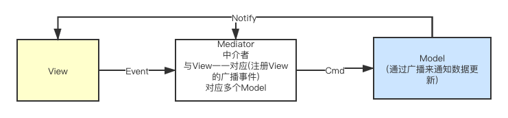

<!-- TOC -->

- [设计思路](#设计思路)
    - [1.MVC简单介绍](#1mvc简单介绍)
    - [基本设计设计思路](#基本设计设计思路)

<!-- /TOC -->
## 设计思路
### 1.MVC简单介绍
* Model  
数据模块 数据更新
* View  
界面显示 主要负责显示数据和接收用户操作
* Controller   
控制模块 主要功能是处理用户的请求 处理业务逻辑

**所有的通信都是单向的**  

---
### 基本设计设计思路
淡化Controller的业务逻辑操作

1. 每一个View和Model之间增加一个中介者**Mediator**来处理业务逻辑  
Mediator和View一一对应   
*使用中介者模式*
2. behavor 通过命令来控制Model  
*使用命令模式*
3. Model 的数据发生改变通过广播的形式来通知 所有的Model通过ModelManager管理
4. View 通过发送 Event 来通知 Mediator 进行业务逻辑处理

