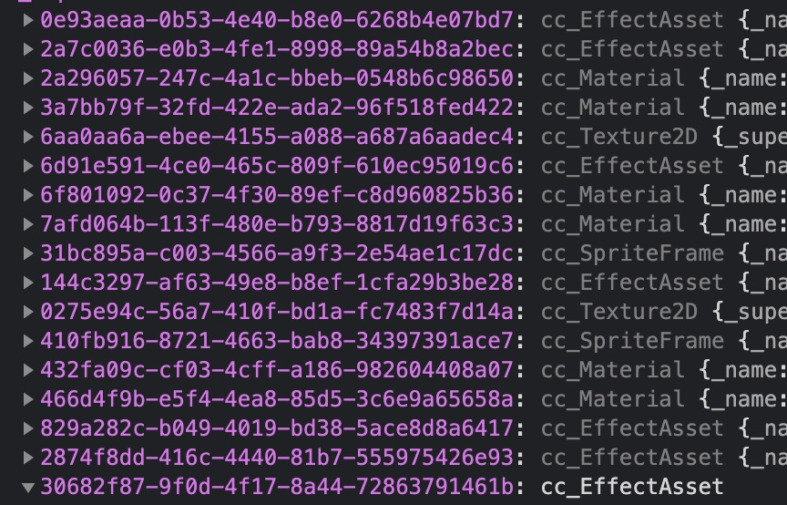
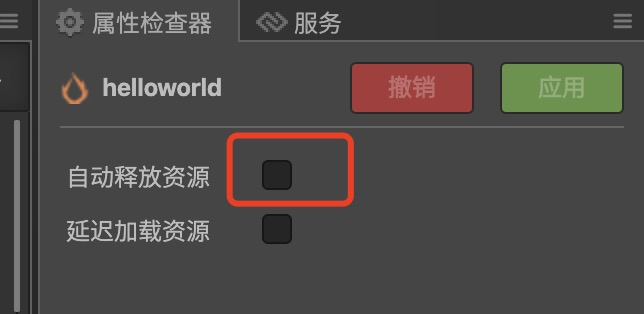
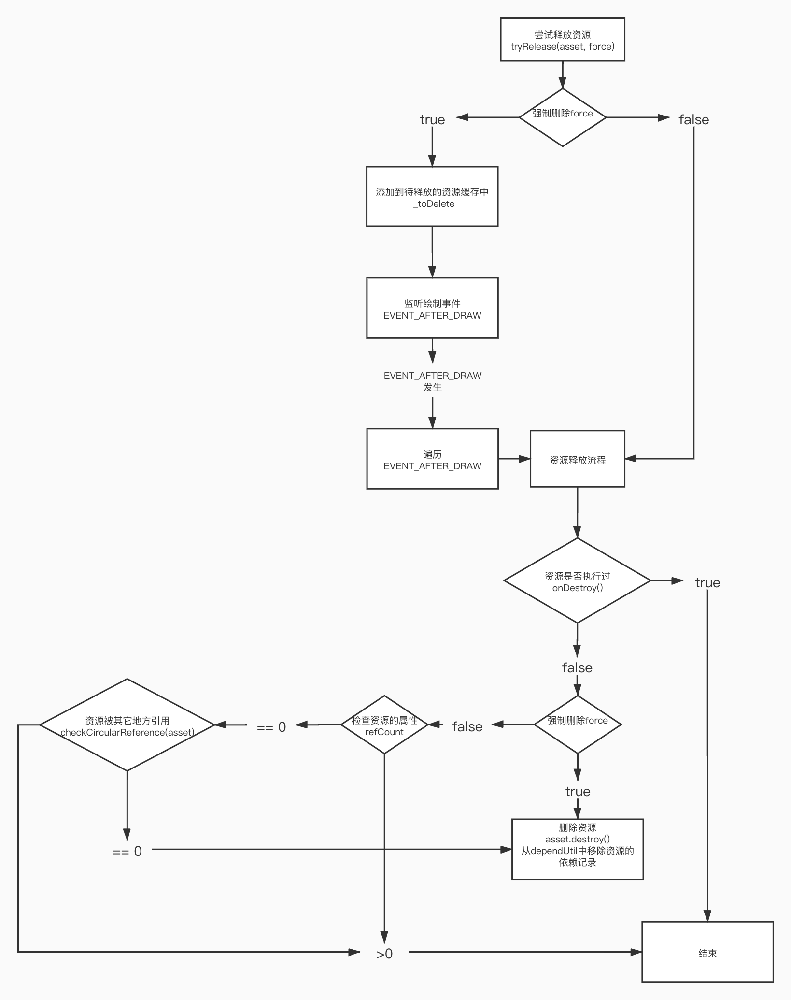

<!--
 * @Author: guofeng
 * @Date: 2021-04-26 17:03:18
 * @LastEditTime: 2021-04-28 10:23:45
 * @LastEditors: guofeng
 * @Description: 
 * @FilePath: /markdown-notes/CocosCreator学习/1.资源的加载与释放.md
 * 
-->
<!-- TOC -->

- [CocosCreator学习笔记(一) 资源的加载和释放](#cocoscreator学习笔记一-资源的加载和释放)
    - [一.资源的缓存位置](#一资源的缓存位置)
    - [二.引用计数法](#二引用计数法)
    - [三.静态引用和动态引用](#三静态引用和动态引用)
        - [静态引用](#静态引用)
            - [引擎如何处理静态引用](#引擎如何处理静态引用)
        - [动态引用](#动态引用)
            - [1.动态加载resources中的资源](#1动态加载resources中的资源)
            - [2.加载bundle中的资源](#2加载bundle中的资源)
            - [3.动态引用的资源管理](#3动态引用的资源管理)
            - [4.源码地址](#4源码地址)
            - [资源删除流程图](#资源删除流程图)

<!-- /TOC -->
# CocosCreator学习笔记(一) 资源的加载和释放

## 一.资源的缓存位置

Creator的资源加载后会存储在**cc.asssetManager.assets**中

类型为**cc.AssetManager.Cache**  一个类似Map的结构



资源可以通过**自动释放**和**手动释放**的方式来进行释放 **cc.assetManager**管理资源的行为和信息，包括加载，释放等。

```typescript
/*@example 
释放单个资源
cc.assetManager.releaseAsset(texture);
*/
releaseAsset(asset: cc.Asset): void;
/**
释放所有资源。详细信息请参考
*/
releaseAll(): void;	

```
## 二.引用计数法

cocos2d-x一种常用的内存管理计数，基本原理将资源的引用次数保存起来，每次释放计数减1，当计数为0时 释放掉资源

**cocoscreator的资源函数**  
addRef() 增加引用计数  
decRef(autoRelease) 减少引用计数  
**注意:**  
 AssetManager只会自动统计`静态引用` 
 开发者`动态引用`的资源需要自己加以控制并释放

## 三.静态引用和动态引用  
### 静态引用
直接在编辑器里使用的资源  
在编辑器里使用的资源 引擎会自动分析出以来资源的列表 这样的资源引用 被视为 **静态引用**

#### 引擎如何处理静态引用 

1. 在**静态加载**某个资源时，引擎会记录该资源所有**直接依赖资源**的信息，并将所有**直接依赖资源**的引用计数加 1，然后将该资源的引用计数初始化为 0

2. 在释放资源时，取得该资源之前记录的所有**直接依赖资源**信息，并将所有依赖资源的引用计数减1 只有资源的引用计数为0时才会被自动释

**场景的自动释放**  
 
 
### 动态引用

#### 1.动态加载resources中的资源
```TypeScript
cc.resources.load("HelloWorld", cc.SpriteFrame, (err, assets: cc.SpriteFrame) => {
    
});
```

#### 2.加载bundle中的资源
```TypeScript
cc.assetManager.loadBundle("bundle", (err: Error, bundle: cc.AssetManager.Bundle) => {
    bundle.load("HelloWorld", cc.SpriteFrame, (err, assets: cc.SpriteFrame) => {
       
    });
});
```

**注意**   
**resources**其实也是官方内置的**Asset Bundle**  
**cc.resources**的类型其实就是  
```ts
export var resources: AssetManager.Bundle;	
```

**官方内置的Bundle**

|内置 Asset Bundle|功能说明|配置|  
|:-- |:--|:--|  
internal|	存放所有内置资源以及其依赖资源|	通过配置 资源管理器 中的 internal -> resources 文件夹，但目前不支持修改默认配置  
main	|存放所有在 构建发布 面板的 参与构建场景 中勾选的场景以及其依赖资源	|通过配置 构建发布 面板的 主包压缩类型 和 配置主包为远程包 两项
resources|存放 resources 目录下的所有资源以及其依赖资源	|通过配置 资源管理器 中的 assets -> resources 文件夹
start-scene	|如果在 构建发布 面板中勾选了 初始场景分包，则首场景将会被构建到 start-scene 中。具体内容可参考 初始场景的资源加载。|无法进行配置 
  
  
所以读取**resources**中的资源使也可以这样
```typescript
let bundle = cc.assetManager.getBundle('resources');
bundle.load("HelloWorld", cc.SpriteFrame, (err, assets: cc.SpriteFrame) => {
       
});

```

#### 3.动态引用的资源管理

* 通过decRef()的方法 使引用计数-1   
creator会根据计数自动进行释放资源。
* 使用assetManager 的相关接口来手动释放资源
```javascript
cc.assetManager.releaseAsset(texture);
```
**注意：**
release系列接口 会直接释放资源 不会进行检查计数。

#### 4.源码地址  
/Resources/engine/cocos2d/core/asset-manager/releaseManager.js

#### 资源删除流程图



