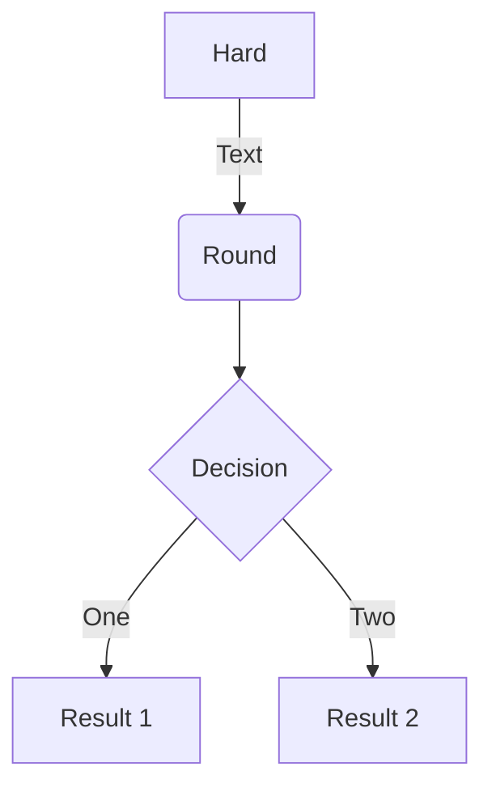
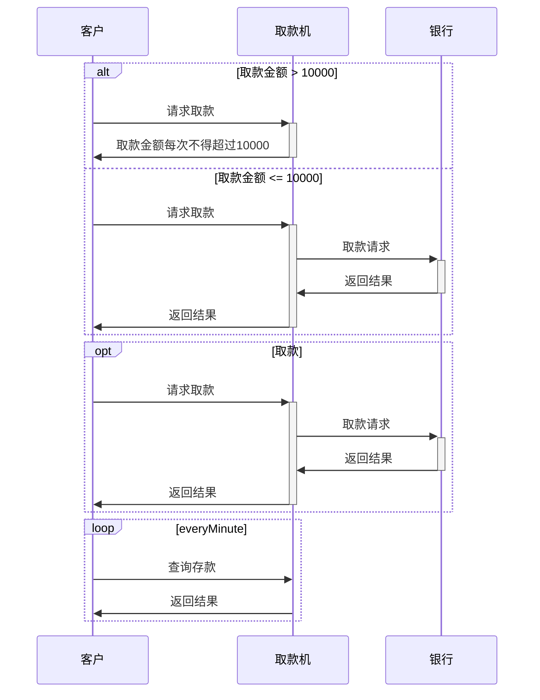
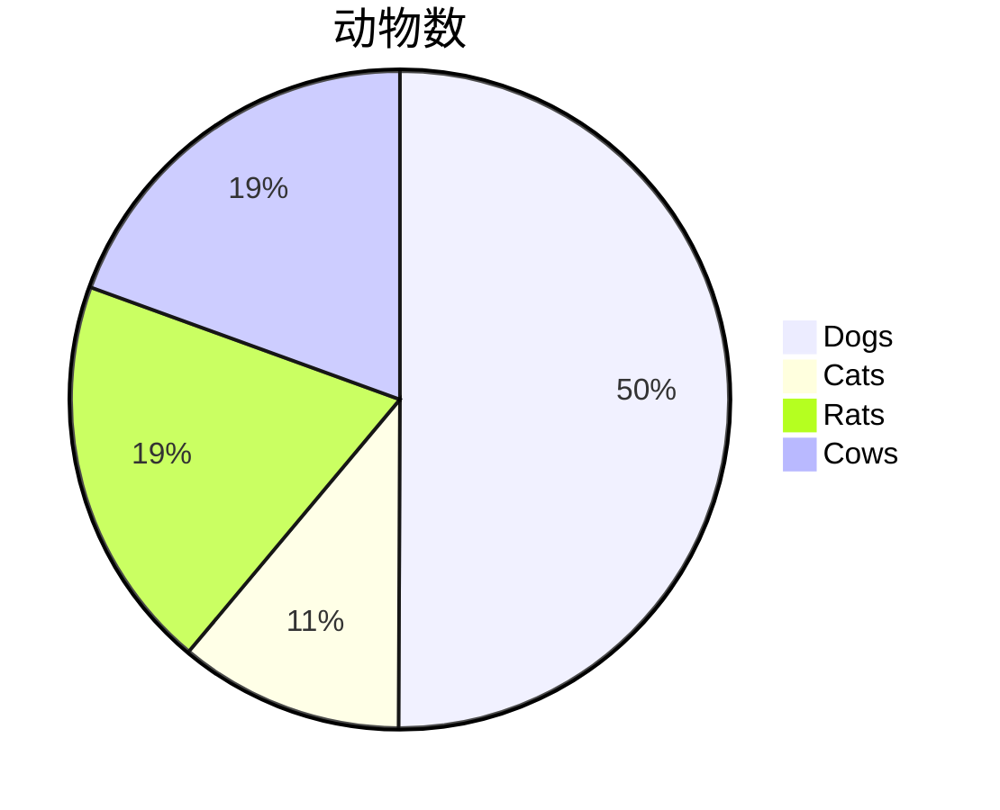
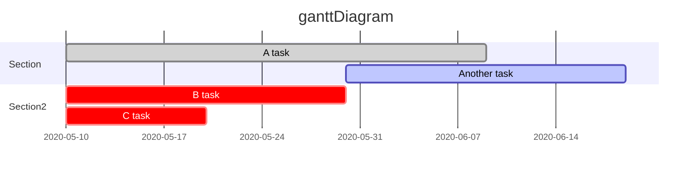

<!-- TOC -->

- [mermaid plantUML使用说明](#mermaid-plantuml使用说明)
    - [一.参考地址](#一参考地址)
    - [二.常用模型](#二常用模型)
        - [1.Flowchar(流程图)](#1flowchar流程图)
        - [2.时序图](#2时序图)
        - [3.饼图](#3饼图)
        - [4.甘特图](#4甘特图)
        - [5.类图(PlantUMl)](#5类图plantuml)

<!-- /TOC -->
# mermaid plantUML使用说明
## 一.参考地址
[参考地址](https://mermaid-js.github.io/mermaid/#/flowchart)

## 二.常用模型

### 1.Flowchar(流程图)




```
graph TD
    A[Hard] -->|Text| B(Round)
    B --> C{Decision}
    C -->|One| D[Result 1]
    C -->|Two| E[Result 2]
    
```

### 2.时序图
* ATM取款


```
sequenceDiagram
    participant A as 客户
    participant B as 取款机
    participant C as 银行
    Alt 取款金额 > 10000
    A ->> +B : 请求取款
    B ->> -A : 取款金额每次不得超过10000
    else 取款金额 <= 10000
    A ->> +B : 请求取款
    B ->> +C : 取款请求
    C ->> -B : 返回结果
    B ->> -A : 返回结果
    end
    opt 取款
    A ->> +B : 请求取款
    B ->> +C : 取款请求
    C ->> -B : 返回结果
    B ->> -A : 返回结果
    end
    loop every Minute
        A ->> +B : 查询存款
        B ->> -A : 返回结果
    end
```

### 3.饼图


```
pie
    title 动物数
    "Dogs" : 386
    "Cats" : 85
    "Rats" : 150 
    "Cows" : 150
```
### 4.甘特图


```
gantt
    title ganttDiagram
    dateFormat YYYY-MM-DD
    section Section
    A task              :done,a1,2020-05-10,30d
    Another task        :active,after a1,20d
    section Section2
    B task              :crit,a1,2020-05-10,20d
    C task              :crit,a2,2020-05-10,2020-05-20
```
### 5.类图(PlantUMl)


