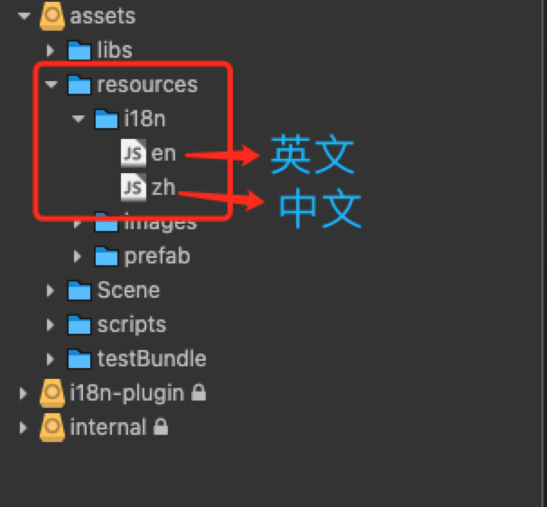
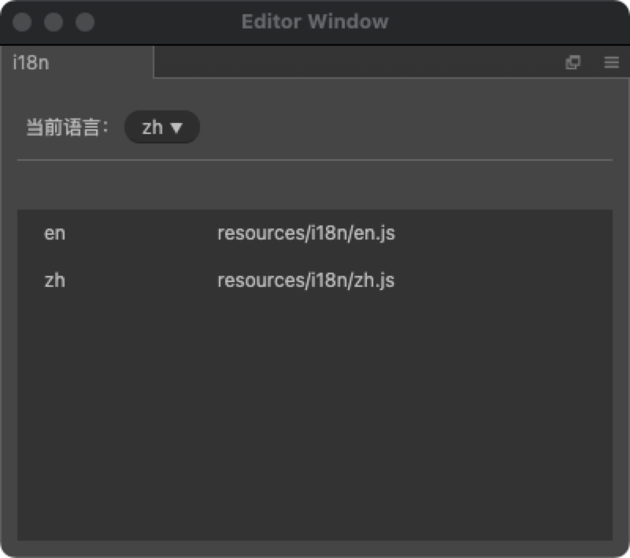
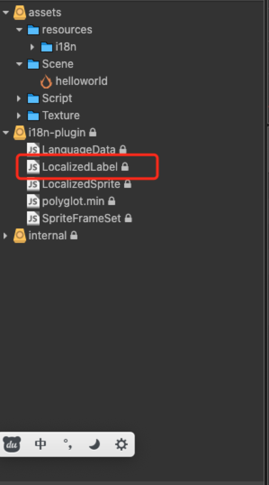
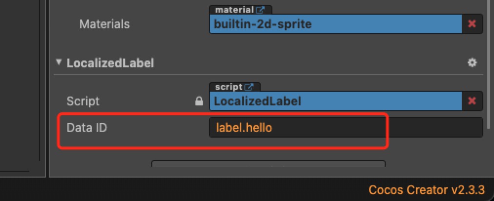
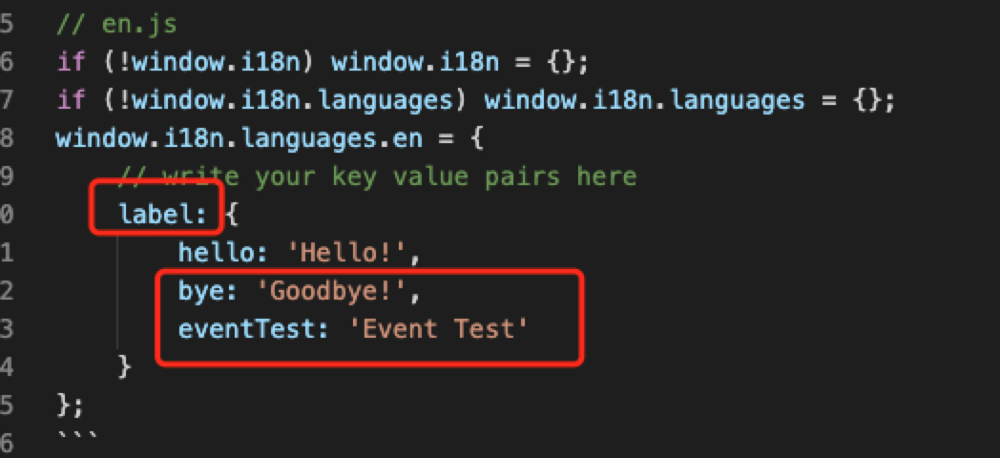

<!-- TOC -->

- [多语言插件i18n](#多语言插件i18n)
    - [手动安装](#手动安装)
    - [创建文字资源文件](#创建文字资源文件)
    - [配置i18n.json文件](#配置i18njson文件)
    - [本地化Label文本](#本地化label文本)
    - [在脚本中使用](#在脚本中使用)

<!-- /TOC -->
## 多语言插件i18n
[下载地址](https://github.com/cocos-creator-packages/i18n)  
[范例地址](https://gitee.com/gf530142771/cocos-mvcframe.git)
### 手动安装 
将下载好的插件放到项目的**packages**文件夹下  

### 创建文字资源文件  
插件安装完成后 会在**resources**文件夹下生成一个**i18n**文件夹,在此文件夹下创建相应的文字文件   

**图例**  
  

**文件示例**
```js
// en.js
if (!window.i18n) window.i18n = {};
if (!window.i18n.languages) window.i18n.languages = {};
window.i18n.languages.en = {
    // write your key value pairs here
    label: {
        hello: 'Hello!',
        bye: 'Goodbye!',
        eventTest: 'Event Test'
    }
};
```

```js
// zh.js
if (!window.i18n) window.i18n = {};
if (!window.i18n.languages) window.i18n.languages = {};
window.i18n.languages.zh = {
    // write your key value pairs here
    label: {
        hello: '你好',
        bye: '再见',
        eventTest: '时间测试'
    }
};
```

### 配置i18n.json文件  
**路径:** 项目路径/settings/i18n.json  

```json
{
  "languages": [
    "en",
    "zh"
  ],
  "default_language": "zh"
}
```  

点击<table><tr><td bgcolor=yellow>扩展/i18n</td><tr></table>
设置当前语言   


### 本地化Label文本  

在 **Label** 组件所在节点 添加 **i18n/LocalizedLabel** 组件。  


**设置文字**   
配置*DataID*属性  

属性值参考自己写的配置文件



### 在脚本中使用

```javascript
const i18n = require('LanguageData');
// 初始化语言
i18n.init('zh');
//如果需要马上更新，配合updateSceneRenderers方法使用
i18n.updateSceneRenderers();
//通过键值获取字符串
i18n.t('label.bye');
```


