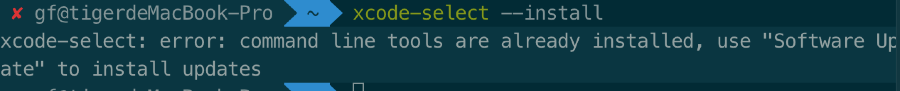

<!--
 * @Author: guofeng
 * @Date: 2020-10-28 10:56:17
 * @LastEditTime: 2020-10-28 12:38:35
 * @LastEditors: guofeng
 * @Description: 
 * @FilePath: /markdown-notes/命令学习/1.xcode命令.md
 * @
-->
## Xcode命令
### 一.Command Line Tool安装
1. 通过终端安装
```shell
xcode-select --install 
```

2. 安装成功后再次输入
```
xcode-select --install
```

出现以下提示说明安装成功


### 二.xcode--select常用命令
1. 显示帮助  

```
xcode-select --help
```

2. 打印安装位置

```
xcode-select --print-path
```
3. 显示版本号

```
xcode-select --version
```

4. 命令重置 

```
xcode-select --reset
```

5. 设置默认版本

```
sudo xcode-select -switch <path/to/>Xcode.app
```

### 3.xcodebuild的一些常用命令
